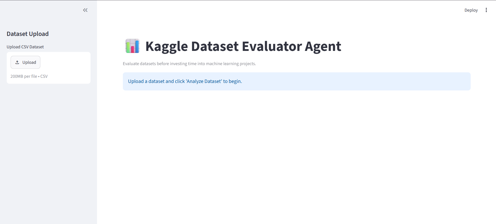
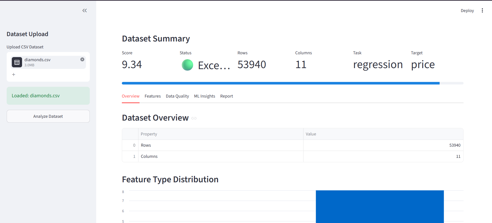
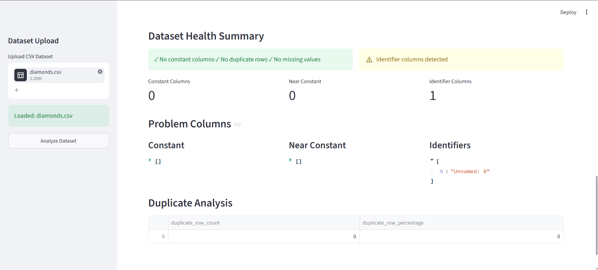
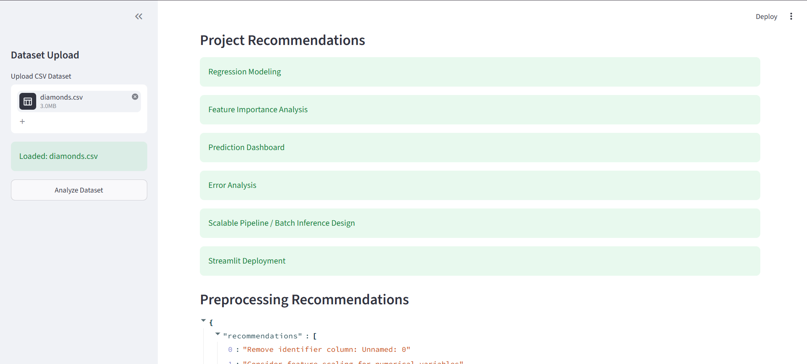
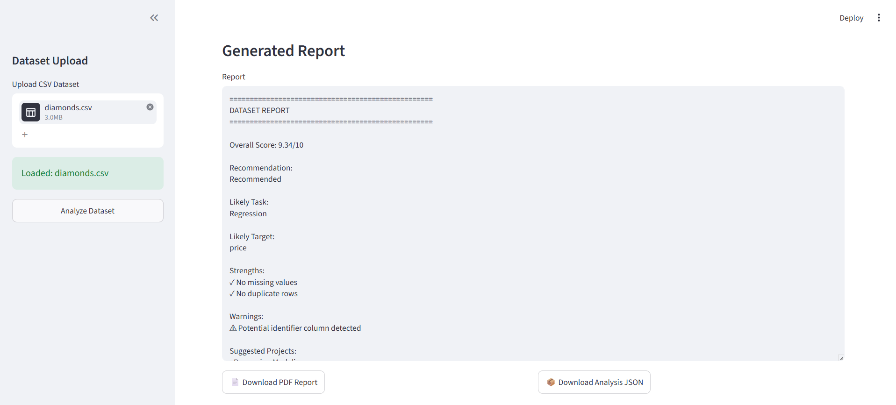
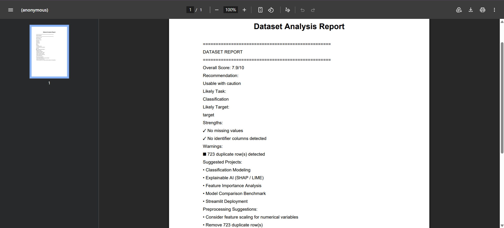
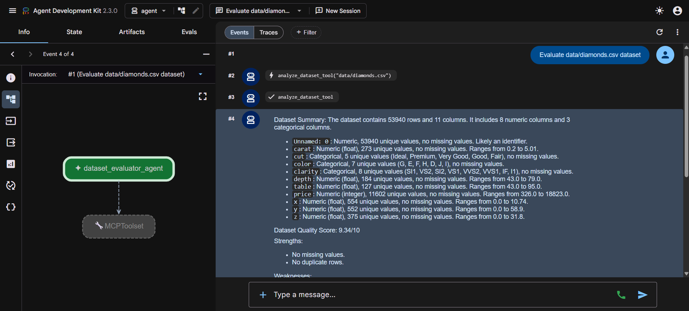
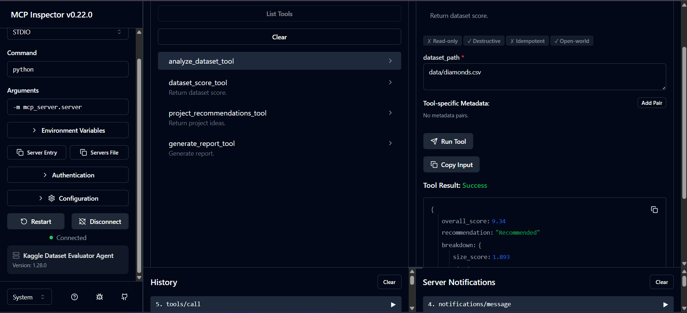

# Kaggle Dataset Evaluator Agent

A Google ADK + MCP powered AI agent that helps users evaluate datasets before investing time in Machine Learning projects.

Instead of immediately jumping into model development, this system analyzes a dataset, assesses its quality, infers likely ML tasks, recommends project ideas, suggests preprocessing steps, and generates a detailed report.

---

# Problem Statement

Choosing a dataset is one of the most important steps in any Machine Learning workflow.

Many datasets appear promising at first glance but may suffer from issues such as:

- Excessive missing values
- Duplicate records
- Identifier columns
- Constant or near-constant features
- Poor target variable quality
- Insufficient data volume
- Lack of useful predictive features

Data scientists and students often spend significant time cleaning and exploring datasets before realizing that the dataset is not suitable for meaningful ML work.

The Kaggle Dataset Evaluator Agent aims to solve this problem by providing an automated dataset evaluation workflow before model development begins.

---

# Features

## Dataset Analysis

The system performs comprehensive dataset analysis including:

- Dataset overview
- Feature-level analysis
- Missing value analysis
- Duplicate detection
- Constant column detection
- Near-constant column detection
- Identifier column detection
- Data quality checks

---

## ML Task Inference

Automatically identifies likely Machine Learning tasks such as:

- Classification
- Regression
- Clustering
- Unsupervised Learning

The system also attempts to identify the most likely target column and provides a confidence score.

---

## Dataset Quality Scoring

Generates an overall dataset quality score out of 10 based on:

- Dataset size
- Missing values
- Duplicate rows
- Feature cleanliness
- ML readiness
- Identifier penalties

Example:

```text
Dataset Score: 9.34 / 10
Recommendation: Recommended
```

---

## Project Recommendations

Generates project ideas tailored to the dataset characteristics.

Examples:

### Regression Dataset

- Price Prediction System
- Sales Forecasting Model
- Demand Prediction Engine

### Classification Dataset

- Disease Risk Prediction
- Customer Churn Prediction
- Fraud Detection System

---

## Preprocessing Recommendations

Provides preprocessing guidance such as:

- Missing value handling
- Feature encoding
- Feature scaling
- Identifier removal
- Constant feature removal

---

## Human-Readable Reports

Generates detailed reports summarizing:

- Dataset overview
- Data quality
- ML task inference
- Recommendations
- Dataset score

Reports can be downloaded directly from the Streamlit frontend.

---

## Security Layer

Dataset access is validated through a dedicated security module.

Implemented checks include:

- File existence validation
- Allowed file extension validation
- File size limits

This prevents unsafe or unintended file access.

---

# System Architecture

```text
                    +----------------------+
                    |     CSV Dataset      |
                    +----------+-----------+
                               |
                               v
                    +----------------------+
                    |   Analysis Engine    |
                    +----------+-----------+
                               |
                               v
                    +----------------------+
                    |      MCP Tools       |
                    +----------+-----------+
                               |
                               v
                    +----------------------+
                    |    FastMCP Server    |
                    +----------+-----------+
                               |
                               v
                    +----------------------+
                    |    Google ADK Agent  |
                    +----------+-----------+
                               |
                               v
                    +----------------------+
                    |       Gemini         |
                    +----------------------+
```

---

# Streamlit Dashboard Architecture

```text
              +-------------------+
              |  Streamlit Front  |
              +---------+---------+
                        |
                        v
              +-------------------+
              |     MCP Tools     |
              +---------+---------+
                        |
                        v
              +-------------------+
              | Analysis Engine   |
              +-------------------+
```

The dashboard uses MCP tools directly for fast dataset analysis while the ADK agent remains available for conversational interactions.

---

# Project Structure

```text

Kaggle Dataset Evaluator Agent/
├── agent/
│   ├── agent.py
│   ├── security.py
│   └── __init__.py
├── data/
│   ├── candidate_job_role_dataset.csv
│   ├── diamonds.csv
│   ├── heart_disease.csv
│   └── sample.csv
├── images/
│   ├── adk_interface.png
│   ├── analysis1.png
│   ├── analysis2.png
│   ├── analysis3.png
│   ├── analysis4.png
│   ├── dashboard.png
│   ├── mcp_inspector.png
│   └── pdf.png
├── mcp_server/
│   ├── server.py
│   ├── tools.py
│   └── __init__.py
├── README.md
├── requirements.txt
├── src/
│   ├── analysis.py
│   ├── test_analysis.py
│   └── __init__.py
├── streamlit_app.py
└── test_mcp.py

```

---

# Analysis Engine

The analysis engine consists of the following modules:

| Function                                   | Purpose                         |
| ------------------------------------------ | ------------------------------- |
| `load_dataset()`                           | Load dataset into a DataFrame   |
| `dataset_overview()`                       | Dataset summary                 |
| `feature_analysis()`                       | Feature-level statistics        |
| `missing_value_analysis()`                 | Missing data inspection         |
| `duplicate_analysis()`                     | Duplicate detection             |
| `constant_columns()`                       | Constant feature detection      |
| `near_constant_columns()`                  | Near-constant feature detection |
| `detect_identifier_columns()`              | Identifier detection            |
| `infer_ml_tasks()`                         | ML task inference               |
| `quality_checks()`                         | Data quality validation         |
| `dataset_score()`                          | Dataset scoring                 |
| `project_recommendations()`                | Project suggestions             |
| `generate_preprocessing_recommendations()` | Data preparation guidance       |
| `generate_report()`                        | Human-readable report           |
| `run_full_analysis()`                      | Full analysis pipeline          |

---

# MCP Tools

The MCP server exposes the following tools:

## analyze_dataset

Returns complete dataset analysis.

```text
Input:
dataset_path

Output:
Full analysis results
```

---

## get_dataset_score

Returns dataset quality score.

```text
Input:
dataset_path

Output:
Dataset score
```

---

## get_project_recommendations

Returns project recommendations.

```text
Input:
dataset_path

Output:
Project ideas
```

---

## generate_dataset_report

Returns a human-readable report.

```text
Input:
dataset_path

Output:
Dataset report
```

---

# Google ADK Integration

The project integrates Google ADK with MCP.

The agent:

- Connects to Gemini
- Discovers MCP tools
- Calls MCP tools dynamically
- Uses tool outputs to answer user questions

MCP connection:

```python
command="python"

args=[
    "-m",
    "mcp_server.server"
]
```

Using the module-based invocation ensures reliable MCP connectivity.

---

# Installation

## Clone Repository

```bash
git clone https://github.com/VRYeshwanth/Kaggle-Dataset-Evaluator-Agent
cd Kaggle-Dataset-Evaluator-Agent
```

---

## Create Virtual Environment

```bash
python -m venv venv
```

Activate:

### Windows

```bash
venv\Scripts\activate
```

### Linux / macOS

```bash
source venv/bin/activate
```

---

## Install Dependencies

```bash
pip install -r requirements.txt
```

---

# Environment Variables

Create a `.env` file and provide your API Key obtained from Google AI Studio:

```env
GOOGLE_API_KEY=YOUR_API_KEY
```

---

# Running the MCP Server

```bash
python -m mcp_server.server
```

---

# Running ADK Web

```bash
adk web
```

---

# Running Streamlit

```bash
streamlit run streamlit_app.py
```

---

# Example Workflow

## Step 1

Upload a dataset through the Streamlit dashboard.

---

## Step 2

Run analysis.

The system automatically performs:

- Dataset inspection
- Quality assessment
- ML task inference
- Recommendation generation

---

## Step 3

Review:

- Dataset Score
- Dataset Health
- Feature Analysis
- Project Ideas
- Preprocessing Suggestions

---

## Step 4

Download:

- PDF Report
- JSON Analysis

---

## Step 5

Use the ADK Agent for follow-up questions.

Examples:

```text
What preprocessing steps should I prioritize?

Why was this dataset scored 9.34?

What ML models would work best?

Suggest advanced project ideas.
```

---

# Screenshots

## Streamlit Dashboard



---

## Analysis Results









---

## PDF Report



---

## ADK Web Agent



---

## MCP Inspector



---

# Future Improvements

Potential future enhancements include:

- Additional dataset quality metrics
- Correlation analysis
- Outlier analysis
- Feature importance estimation
- Dataset comparison workflows
- Automated EDA visualizations
- Programmatic ADK chat integration into Streamlit

---

# Technologies Used

- Python
- Pandas
- NumPy
- Streamlit
- FastMCP
- Model Context Protocol (MCP)
- Google ADK
- Gemini
- ReportLab

---

# Key Concepts Demonstrated

This project demonstrates:

- AI Agents
- Tool Calling
- Model Context Protocol (MCP)
- Dataset Quality Evaluation
- Automated ML Dataset Assessment
- Secure Data Processing
- Human-AI Interaction
- Agent-Based Analytics

---

# License

This project is intended for educational and demonstration purposes as part of the Google x Kaggle AI Agents Capstone.
